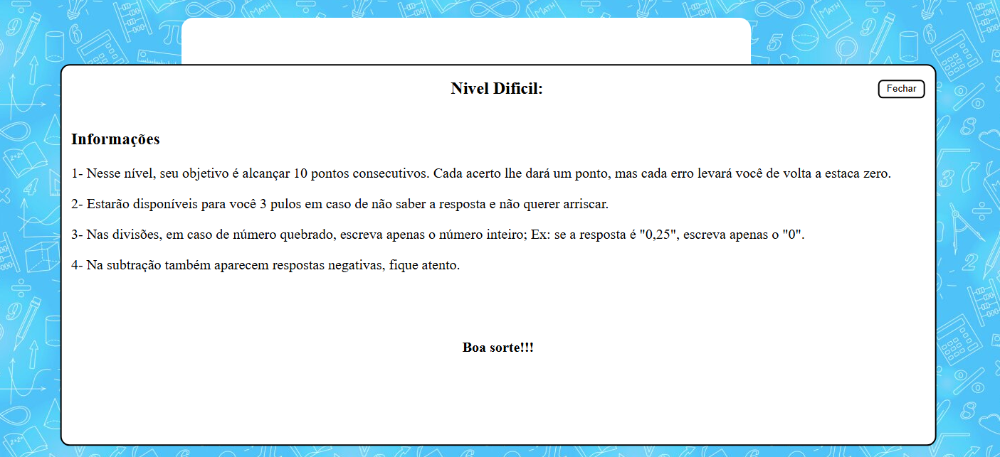

# 🧠 Feira de Ciências — Jogo Educativo de Matemática

Projeto desenvolvido para a Feira de Ciências e que chegou ao nível regional indo para o Ceará Científico 2023, com foco em **educação matemática interativa**.  

A proposta é apresentar um jogo simples e acessível que estimula o raciocínio lógico e a prática de operações básicas de forma divertida.

---

## 🎯 Objetivo

Criar uma ferramenta lúdica que auxilie alunos do ensino fundamental a praticarem matemática de forma leve e engajante. 

O jogo foi apresentado como parte de um projeto escolar e recebeu destaque pela sua proposta acessível e visual intuitivo.

---

## 🕹️ Como Funciona

- O jogador deve resolver operações matemáticas simples (adição, subtração, multiplicação e divisão).
- Cada acerto gera um feedback positivo e incentiva a continuidade.
- O jogo é totalmente baseado em HTML, CSS e JavaScript, sem necessidade de instalação.

---

## 🛠️ Tecnologias Utilizadas

- **HTML5** — estrutura das páginas  
- **CSS3** — estilização visual  
- **JavaScript** — lógica do jogo e interatividade  
- **Imagens e ícones** — elementos visuais para engajamento

---

## 📁 Estrutura do Projeto

- `index.html` — página principal do jogo que leva aos dois modos disponíveis  
- `style.css` — estilos aplicados ao layout  
- `script.js` — lógica do jogo e validação das respostas  
- `img/` — pasta com imagens e ícones utilizados  
- `LICENSE` — licença MIT

---

## 🚀 Como Executar Localmente

```bash
# Clone o repositório
git clone https://github.com/jessicacristinass/Feira-de-Ciencias

# Acesse a pasta e abra o arquivo index.html no navegador
```

Ou acesse a versão publicada no GitHub Pages:

🔗[jessicacristinass.github.io/Feira-de-Ciencias](https://jessicacristinass.github.io/Feira-de-Ciencias/)